# gpha-mscape-genomad-nf

## What is this?

A nextflow pipeline wrapping [geNomad](https://github.com/apcamargo/genomad), designed to run on [mSCAPE](https://mscape.climb.ac.uk/).

## How do I use this?

On the CLIMB infrastructure, you'd run a command not dissimilar to the following, replacing `<CLIMB-ID>` with an actual CLIMB ID.

```bash
nextflow run                      \
	main.nf                       \
	--profile docker              \
	--unique_id <CLIMB-ID>        \
	-e.ONYX_DOMAIN=$ONYX_DOMAIN   \
    -e.ONYX_TOKEN=$ONYX_TOKEN
```

The site nextflow config stored at `/etc/nextflow.config` is required as a `-c` argument if your `nextflow` command has not already been aliased to include this.

## What's the theory behind it?

Something like this:

```mermaid
graph TD

graphStart(["Start"])
userInput{"Parse commandline args"}
onyxQuery["Retrieve record from Onyx save as samplesheet"]
endiannessDecision{"Single or paired end?"}
preprocessingOption1["Retrieve and stage unclassified.fastq.gz"]
preprocessingOption2["Skip processing"]
processingStageOne["fastq.gz to fasta"]
processingStageTwo["Process fasta with geNomad"]
output["Result published to<br>genomad_results/&lt;CLIMB‑ID&gt;"]
graphEnd(["End"])

graphStart --> userInput
userInput -- CLIMB ID<br>provided via args ---> onyxQuery 
userInput -- "Samplesheet<br>provided via args" ---> endiannessDecision 
onyxQuery --> endiannessDecision
endiannessDecision -- Single ---> preprocessingOption1
endiannessDecision -- Paired ---> preprocessingOption2
preprocessingOption1 --> processingStageOne --> processingStageTwo
preprocessingOption2 --> graphEnd
processingStageTwo --> output --> graphEnd
```


